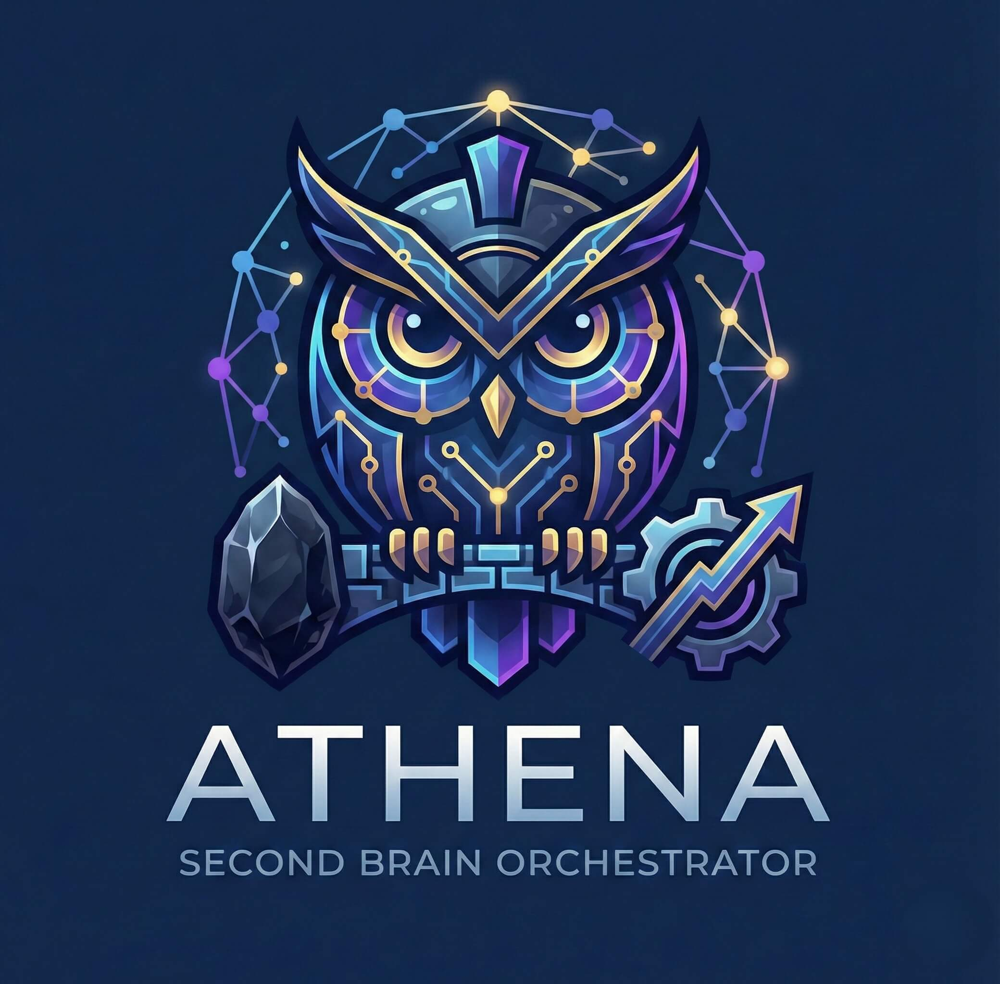

# Athena - Second Brain Orchestrator Agent

<div align="center">
  
</div>

<div align="center">


**Turn scattered knowledge into focused action through intelligent, conversational orchestration.**

[Demo Video](https://youtube.com/PLACEHOLDER) | [Quick Start](#-quick-start) | [Features](#-key-features) | [Architecture](#%EF%B8%8F-architecture) | [Documentation](#-documentation)

</div>

---

## Overview

Athena is a conversational AI agent built on [Elastic Agent Builder](https://www.elastic.co/elasticsearch/agent-builder) that bridges your [Obsidian](https://obsidian.md) vault with [Artemis](services/artemis-backend/) (included), a productivity app. It searches your notes semantically, reads and writes to your vault in real-time, extracts tasks with Eisenhower classification, plans your day using the 1-3-5 rule, and remembers past conversations — all through natural language, text or voice.

**What makes Athena different:**
- **Dual-Path Knowledge** - Elasticsearch (ELSER) for semantic search *and* direct vault filesystem for real-time read/write
- **Bidirectional** - Creates notes, appends to journals, organizes your vault — not just read-only search
- **Human-in-the-Loop** - Never creates tasks or modifies notes without your explicit confirmation
- **Voice-First Option** - Whisper STT + OpenAI TTS — talk to your second brain and hear it respond
- **Proactive Agent** - Heartbeat service nudges you about overdue tasks, missing plans, and approaching deadlines
- **Reusable Skills** - Save multi-step workflows as vault skills — "run my morning routine" loads and executes steps automatically

---

## Key Features

- **Semantic Vault Search** - Hybrid ELSER + keyword search across your entire Obsidian vault with relevance scoring
- **Direct Vault CRUD** - Read, create, append, edit, move, and delete notes in real-time via MCP tools
- **Task Extraction** - Identify action items in notes and classify them using the Eisenhower Matrix (Q1-Q4)
- **Daily Planning** - 1-3-5 rule: 1 major task, 3 medium tasks, 5 small tasks — planned by the agent from your pending work
- **Pomodoro Timer** - Start focus sessions linked to specific tasks, with productivity analytics
- **Conversation Memory** - Summaries persisted to Elasticsearch and daily notes for cross-session continuity
- **Web Research** - Search the web and fetch URLs to bring external knowledge into your workflow
- **Voice Interaction** - Whisper STT + OpenAI TTS — speak naturally and hear responses read aloud
- **Proactive Heartbeat** - Scheduled check-ins evaluate a vault checklist and surface alerts to your daily note
- **Runtime Skills** - Define reusable multi-step workflows as vault markdown files — the agent creates, loads, and executes them
- **One-Command Setup** - `./setup.sh` validates credentials, creates tables, indexes vault, and configures Agent Builder

---

## Status & Metrics

- **20 Tools Registered** - 6 ES|QL (read-only analytics) + 14 MCP (read/write operations) in Elastic Agent Builder
- **8 Sub-Projects** - Indexer, MCP server, voice client, agent config, heartbeat, Artemis backend, frontend, setup scripts
- **23 Sample Notes** - Demo vault with 7 folders, 135+ wikilinks, realistic project/meeting/daily note content
- **Full E2E Validation** - 28/28 integration tests passing across all components
- **Automated Setup** - One command configures Supabase, Elasticsearch, and Agent Builder from `.env`
- **Type Safe** - pyright with 0 errors across all Python sub-projects

---

## Quick Start

### Prerequisites

| Requirement | Version | Installation Guide |
|-------------|---------|-------------------|
| Python | 3.12+ | [python.org](https://www.python.org/downloads/) |
| uv | Latest | [docs.astral.sh/uv](https://docs.astral.sh/uv/) |
| Docker | 20.10+ | [docker.com](https://docs.docker.com/get-docker/) |
| Docker Compose | 2.0+ | Included with Docker Desktop |

**Accounts Required:**
- [Elastic Cloud](https://cloud.elastic.co/registration?cta=hackathon) (free 14-day Serverless trial) - Elasticsearch + Agent Builder
- [Supabase](https://supabase.com/dashboard) (free tier) - Database for Artemis
- [ngrok](https://ngrok.com/) (free) - Expose MCP server to Elastic Cloud
- [OpenAI](https://platform.openai.com) (optional) - Voice (Whisper + TTS) and research

<details>
<summary><strong>Detailed Setup Guides</strong></summary>

- **Elastic Cloud**: Sign up, create a Serverless project, copy the Elasticsearch URL and API key
- **Supabase**: Create a project, copy the URL and anon key from Settings > API
- **ngrok**: Sign up, get your auth token, claim a free static domain at Dashboard > Domains
- **Agent Builder**: See [`agent-config/setup-guide.md`](agent-config/setup-guide.md) for manual Kibana configuration

</details>

### Automated Setup (Recommended)

```bash
# 1. Clone and configure
git clone https://github.com/StratosL/Athena.git
cd Athena
cp .env.example .env
# Edit .env with your credentials — see .env.example for docs on each variable

# 2. Run setup (validates, creates tables, indexes vault, configures Agent Builder)
./setup.sh              # Linux/macOS
setup.bat               # Windows

# 3. Start all services
docker compose --profile tunnel up --build
```

**Access:**
- **Artemis Dashboard**: http://localhost:3000
- **Artemis API**: http://localhost:8000
- **MCP Server**: http://localhost:8001
- **Voice Client**: http://localhost:3001
- **Chat with Athena**: Kibana > Agent Builder > Athena

Run individual setup phases as needed:

```bash
./setup.sh --phase validate        # check credentials + connectivity
./setup.sh --phase supabase        # create database tables
./setup.sh --phase elasticsearch   # create indices + index vault
./setup.sh --phase agent-builder   # register tools + create agent in Kibana
./setup.sh --phase verify          # end-to-end health checks
```

<details>
<summary><strong>Manual Setup (Step-by-Step)</strong></summary>

```bash
# 1. Create Elasticsearch indices and index your vault
cd indexer && uv sync
uv run athena-index setup-indices
uv run athena-index index
cd ..

# 2. Start the MCP server
cd mcp-server && uv sync
uv run python -m src    # Streamable HTTP on port 8001
```

> **Important**: Always use `python -m src`, never `python -m src.server` — the latter causes a double-import bug.

```bash
# 3. Expose to Elastic Cloud via ngrok
ngrok http 8001

# 4. Configure Agent Builder in Kibana
# See agent-config/setup-guide.md for detailed instructions
```

</details>

### Quick Test

```bash
# MCP server responds to Streamable HTTP
curl -X POST http://localhost:8001/ \
  -H "Content-Type: application/json" \
  -H "Accept: application/json, text/event-stream" \
  -d '{"jsonrpc":"2.0","id":1,"method":"initialize",
       "params":{"protocolVersion":"2024-11-05","capabilities":{},
                 "clientInfo":{"name":"test","version":"0.1"}}}'

# Voice proxy is healthy
curl http://localhost:3001/api/health

# Notes are indexed
curl -s "$ELASTIC_URL/athena-notes/_count" \
  -H "Authorization: ApiKey $ELASTIC_API_KEY"
```

**Test queries in Kibana Agent Builder chat:**
- "What are my notes about the API refactoring?" — semantic search
- "Read my daily note for Feb 12" — direct vault read
- "Extract tasks from the Sprint Review note" — task extraction with Eisenhower classification
- "Plan my day" — 1-3-5 daily planning
- "Run my morning routine" — skill execution from vault

---

## Architecture

```
User <-> Voice Layer (STT/TTS) <-> Agent Builder (Athena) <-> Elasticsearch (ELSER)
              |                                                     ^
              v MCP Protocol                                        | ES|QL
         Athena MCP Server                                          |
           |-- Vault tools     -> Obsidian Vault (filesystem)       |
           |-- Artemis tools   -> Artemis REST API (:8000)          |
           |-- Skills tools    -> Vault Meta/Skills/ (workflows)    |
           |-- Knowledge tools -> Elasticsearch (write-back)        |
           '-- Research tools  -> Web search + URL fetch            |
                                                                    |
         Indexer CLI ---------- Obsidian Vault -> Elasticsearch ----'
```

**Tech Stack:**

| Component | Technology | Purpose |
|-----------|-----------|---------|
| **Orchestrator** | Elastic Agent Builder | System prompt, tool routing, conversation management |
| **Search** | Elasticsearch Serverless + ELSER v2 | Semantic search via `semantic_text` auto-embedding |
| **Tool Protocol** | MCP (Streamable HTTP) | Standard protocol for Agent Builder <> tool communication |
| **Vault Access** | Python + `python-frontmatter` | Direct filesystem CRUD on Obsidian `.md` files |
| **Task Management** | Artemis (FastAPI + Supabase) | REST API for tasks, daily plans, pomodoro sessions |
| **Frontend** | React + Vite + Tailwind | Artemis dashboard with Athena chat sidebar |
| **Voice** | OpenAI Whisper (STT) + TTS | Browser MediaRecorder, proxy server for API calls |
| **Infrastructure** | Docker Compose + ngrok | One-command startup with optional tunnel profile |
| **Heartbeat** | APScheduler | Proactive agent check-ins via converse API |

**Architecture Pattern:** Dual-path knowledge access — Elasticsearch for semantic search and analytics, direct vault filesystem for real-time read/write. The indexer syncs vault to ES; the VaultManager reads/writes vault directly.

<details>
<summary><strong>Project Structure</strong></summary>

```
Athena/
├── services/
│   └── artemis-backend/      # Artemis FastAPI backend (Supabase + tasks)
│       ├── Dockerfile
│       ├── pyproject.toml
│       └── app/
├── frontend/                  # Artemis React frontend (Vite + Tailwind + ChatSidebar)
│   ├── Dockerfile
│   ├── package.json
│   └── src/
├── indexer/                   # Obsidian -> Elasticsearch sync (CLI)
├── mcp-server/                # Unified MCP server (14 tools)
├── voice-client/              # Voice-enabled web client + proxy server
├── agent-config/              # Agent Builder system prompt + tool definitions
├── heartbeat/                 # Proactive agent check-ins (APScheduler)
├── scripts/                   # Setup automation (validate, setup, verify)
├── decisions/                 # Architecture Decision Records (11 ADRs)
├── sample-vault/              # Demo Obsidian vault (23 notes, 7 folders)
├── supabase/migrations/       # SQL schema for Artemis tables
├── docker-compose.yml         # All services, one-command startup
├── setup.sh                   # Automated setup entry point
└── .env.example               # All configuration variables
```

</details>

---

## Tool Reference

**20 tools total** — 6 ES|QL (read-only analytics) + 14 MCP (read/write operations).

| Tool | Type | Purpose |
|------|------|---------|
| `search_notes` | ES|QL | Semantic + full-text hybrid search (ELSER) |
| `get_recent_notes` | ES|QL | Notes modified within a time window |
| `get_notes_by_tag` | ES|QL | Filter by tag |
| `count_notes_by_tag` | ES|QL | Tag distribution stats |
| `get_conversation_history` | ES|QL | Recall past conversations |
| `semantic_search` | Index Search | Dynamic natural-language query |
| `vault_query` | MCP | List structure, search content, filter by metadata, recent changes |
| `vault_read` | MCP | Read note, read multiple, daily note |
| `vault_manage` | MCP | Create, append, edit, move, delete note, create folder |
| `artemis_create_task` | MCP | Create task with Eisenhower quadrant |
| `artemis_list_tasks` | MCP | List tasks (filter by quadrant/status) |
| `artemis_complete_task` | MCP | Mark task completed |
| `artemis_get_daily_plan` | MCP | Get today's 1-3-5 plan |
| `artemis_assign_to_plan` | MCP | Assign task to major/medium/small slot |
| `artemis_get_analytics` | MCP | Productivity summary (day/week/month) |
| `artemis_start_pomodoro` | MCP | Start a focus session |
| `save_conversation_summary` | MCP | Persist conversation context to ES + daily note |
| `web_search` | MCP | Web search via Tavily/Brave API |
| `fetch_url` | MCP | Fetch and extract text from a URL |
| `skill_manager` | MCP | List, load, create, edit, delete reusable workflow skills |

---

## Configuration

All settings via environment variables (`.env` file). See [`.env.example`](.env.example) for the full list.

| Variable | Required | Default | Purpose |
|----------|----------|---------|---------|
| `ELASTIC_URL` | Yes | — | Elasticsearch Serverless endpoint |
| `ELASTIC_API_KEY` | Yes | — | Elasticsearch API key |
| `VAULT_PATH` | Yes | `./sample-vault` | Path to Obsidian vault |
| `SUPABASE_URL` | For Artemis | — | Supabase project URL |
| `SUPABASE_ANON_KEY` | For Artemis | — | Supabase anonymous key |
| `SUPABASE_DB_URL` | For auto-setup | — | Postgres connection string (DDL) |
| `ARTEMIS_BASE_URL` | No | `http://localhost:8000` | Artemis backend URL |
| `MCP_SERVER_PORT` | No | `8001` | MCP server port |
| `OPENAI_API_KEY` | For voice | — | Whisper STT + TTS |
| `BRAVE_API_KEY` | For research | — | Web search (or `TAVILY_API_KEY`) |
| `NGROK_DOMAIN` | For Agent Builder | — | Static ngrok domain |

---

## Development

### Code Quality

```bash
# Lint and format
cd indexer && uv run ruff check src/ && uv run ruff format src/
cd mcp-server && uv run ruff check src/ && uv run ruff format src/

# Type checking
cd indexer && uv run pyright src/
cd mcp-server && uv run pyright src/

# Live vault sync (watches for file changes)
cd indexer && uv run athena-index watch
```

### Docker Profiles

```bash
# Default: Artemis backend + frontend + MCP server + voice proxy + indexer watcher
docker compose up --build

# With ngrok tunnel (needed for Agent Builder)
docker compose --profile tunnel up --build

# With proactive heartbeat (costs LLM tokens)
docker compose --profile heartbeat up --build
```

---

## Documentation

| Resource | Description |
|----------|-------------|
| **[PRD](PRD.md)** | Product Requirements Document — single source of truth |
| **[Setup Guide](agent-config/setup-guide.md)** | Manual Agent Builder configuration in Kibana |
| **[System Prompt](agent-config/system-prompt.md)** | Athena's persona, tool routing, and workflows |
| **[Tool Definitions](agent-config/tools/)** | ES|QL and index search tool JSON specs |
| **[.env.example](.env.example)** | All configuration variables with documentation |
| **[Development Log](DEVLOG.md)** | Session-by-session build diary |
| **[Decisions](decisions/)** | Architecture Decision Records (11 ADRs) |

---

## Troubleshooting

<details>
<summary><strong>MCP server connection timeout in Agent Builder</strong></summary>

**Solutions:**
- Verify ngrok is running: check http://localhost:4040
- Confirm MCP server is healthy: `curl -X POST http://localhost:8001/`
- Check the ngrok domain matches `NGROK_DOMAIN` in `.env`
- Re-register the MCP connector in Kibana if the URL changed

</details>

<details>
<summary><strong>ES|QL query errors or no search results</strong></summary>

**Solutions:**
- Verify indices exist: `GET athena-notes/_count` in Kibana Dev Tools
- Re-run the indexer: `cd indexer && uv run athena-index index`
- Check ELSER is available: verify `.elser-2-elastic` inference endpoint in your Elastic project
- Ensure `VAULT_PATH` points to a vault with `.md` files

</details>

<details>
<summary><strong>Artemis tools fail or return connection errors</strong></summary>

**Solutions:**
- Verify Artemis is running: `curl http://localhost:8000/health`
- Check Supabase credentials in `.env`
- Run `./setup.sh --phase supabase` to create tables
- Review logs: `docker compose logs artemis`

</details>

<details>
<summary><strong>Voice features not working</strong></summary>

**Solutions:**
- Verify `OPENAI_API_KEY` is set in `.env`
- Check voice proxy health: `curl http://localhost:3001/api/health`
- Ensure browser has microphone permissions
- Try Chrome/Edge (best MediaRecorder support)

</details>

<details>
<summary><strong>Setup script fails</strong></summary>

**Solutions:**
- Run `./setup.sh --phase validate` to check credentials
- Ensure `.env` exists: `cp .env.example .env`
- Check Python 3.12+ and `uv` are installed
- For Supabase DDL: set `SUPABASE_DB_URL` or paste SQL manually (script provides instructions)

</details>

---

## Roadmap

### Completed

- [x] **Phase 1** - Indexer + ES|QL tools + sample vault
- [x] **Phase 2** - MCP server with 14 tools (vault, Artemis, knowledge, research, skills)
- [x] **Phase 3** - Agent Builder deployment with 20 tools + system prompt
- [x] **Phase 4** - Docker Compose with full stack (6 services + ngrok)
- [x] **Phase 5** - Artemis monorepo merge + chat sidebar integration
- [x] **Phase 6** - Memory system (profile + long-term memory + daily note write-back)
- [x] **Phase 7** - Heartbeat service (proactive agent check-ins via APScheduler)
- [x] **Phase 8** - Setup automation (`./setup.sh` one-command bootstrap)
- [x] **Phase 9** - Skills system (vault runtime skills + Claude Code developer skills)
- [x] **Phase 10** - Demo video, Devpost submission, social post

### Future

- [ ] **Streaming Responses** - SSE token-by-token output in chat sidebar
- [ ] **Elastic Workflows** - Automated vault watcher and daily planning assistant
- [ ] **Wake Word Detection** - "Hey Athena" via Picovoice Porcupine
- [ ] **Streaming TTS** - Progressive audio playback for sub-second voice feel
- [ ] **Backlink Analysis** - Traverse wikilink graphs via Elasticsearch
- [ ] **Multi-Vault Support** - Switch between vaults without re-indexing
- [ ] **Community Skill Marketplace** - Share reusable workflow templates across users

---

## Hackathon

**Event:** [Elasticsearch Agent Builder Hackathon](https://elasticsearch.devpost.com/) | **Deadline:** February 27, 2026 | **Prize Pool:** $20,000

**Submission:** [Devpost](https://devpost.com/software/PLACEHOLDER) | [Demo Video](https://youtube.com/PLACEHOLDER)

---

## License

This project is licensed under the MIT License - see the [LICENSE](LICENSE) file for details.

---

## Acknowledgments

**Athena** is a solo hackathon project created by **Stratos Louvaris**.

**Powered by:**
- [Elastic Agent Builder](https://www.elastic.co/elasticsearch/agent-builder) - Orchestrator with built-in tool routing and conversation management
- [Elasticsearch Serverless](https://www.elastic.co/elasticsearch/serverless) - ELSER v2 semantic search
- [Supabase](https://supabase.com) - Backend infrastructure for Artemis
- [Obsidian](https://obsidian.md) - The knowledge vault that Athena bridges
- [OpenAI](https://platform.openai.com) - Whisper STT + TTS for voice interaction
- [Claude Code](https://claude.ai/claude-code) - AI-assisted development

---

<div align="center">

**Made with Love by Stratos Louvaris**

**Built for the [Elasticsearch Agent Builder Hackathon 2026](https://elasticsearch.devpost.com/)**

[GitHub](https://github.com/StratosL/Athena) | [Documentation](docs/) | [Report Issue](https://github.com/StratosL/Athena/issues)

</div>
